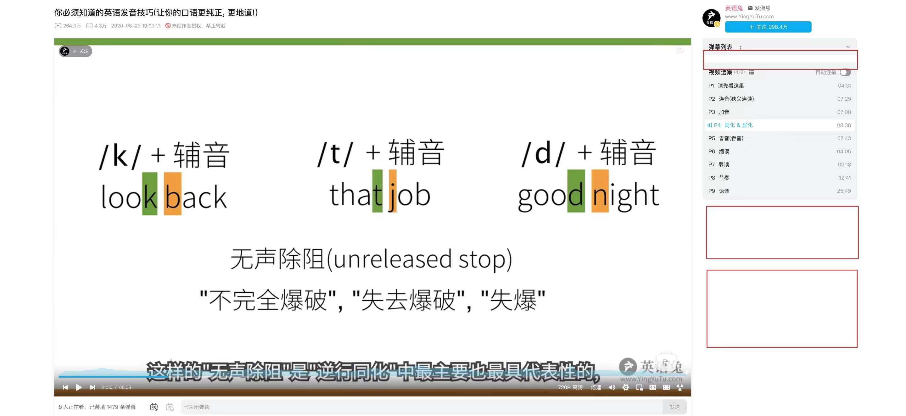

在脚本[B 站纯净模式](https://greasyfork.org/zh-CN/scripts/501560-b%E7%AB%99%E7%BA%AF%E5%87%80%E6%A8%A1%E5%BC%8F)的基础上隐藏弹幕列表上下广告

此仓库对应的脚本: [B 站纯净模式 2\_隐藏弹幕列表上下广告](https://greasyfork.org/zh-CN/scripts/510111-b%E7%AB%99%E7%BA%AF%E5%87%80%E6%A8%A1%E5%BC%8F2-%E9%9A%90%E8%97%8F%E5%BC%B9%E5%B9%95%E5%88%97%E8%A1%A8%E4%B8%8A%E4%B8%8B%E5%B9%BF%E5%91%8A)

我还创建了个 github 的仓库, 只是为了给大家一个共建的平台, 原作者有意的话可转让该仓库 or 给所有的权限

    
